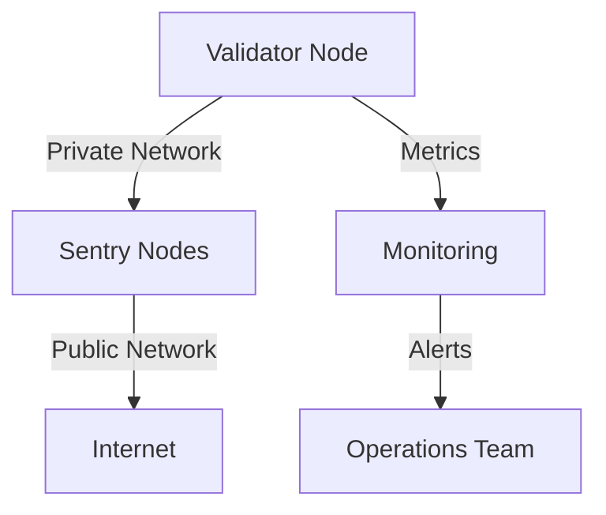

# Infrastructure Setup Guide

## Architecture Overview


## Base Infrastructure

### Hardware Requirements
```
Validator Node:
CPU: 8+ cores
RAM: 64GB+
Storage: 4TB+ NVMe SSD
Network: 1Gbps+

Sentry Nodes (each):
CPU: 4+ cores
RAM: 32GB
Storage: 2TB SSD
Network: 1Gbps
```

### Network Setup
```bash
# Private Network (validator-sentry)
Interface: eth1
Network: 10.0.0.0/24
Firewall: Allow only necessary ports

# Public Network (sentry-internet)
Interface: eth0
Firewall: Rate limiting enabled
DDoS Protection: Enabled
```

## Deployment Guide

### 1. Initial Setup
```bash
# System preparation
apt update && apt upgrade -y
apt install ufw fail2ban prometheus node-exporter

# Create service user
adduser cosmos --disabled-password
usermod -aG sudo cosmos
```

### 2. Network Security
```bash
# UFW setup
ufw default deny incoming
ufw default allow outgoing
ufw allow 22/tcp
ufw allow 26656/tcp  # P2P for sentry only
ufw enable

# fail2ban
cp /etc/fail2ban/jail.conf /etc/fail2ban/jail.local
systemctl enable fail2ban
systemctl start fail2ban
```

### 3. Node Configuration
```toml
# config.toml
[p2p]
pex = false  # validator
addr_book_strict = false
persistent_peers = "sentry_node_ids"
private_peer_ids = "validator_node_id"

# app.toml
minimum-gas-prices = "0.025uatom"
pruning = "custom"
pruning-keep-recent = "100"
```

## High Availability Setup

### Primary DC
```
┌─────────────┐
│  Validator  │
└──────┬──────┘
       │
┌──────┴──────┐
│   Sentry    │
└─────────────┘
```

### Backup DC
```
┌─────────────┐
│  Validator  │
└──────┬──────┘
       │
┌──────┴──────┐
│   Sentry    │
└─────────────┘
```

### Failover Process
1. Monitor primary validator
2. Detect failures automatically
3. Switch to backup validator
4. Resume operations

## Storage Management

### Volume Setup
```bash
# Create volumes
lvcreate -L 4T vg0 -n cosmos_data

# Mount options
mount -o noatime,data=ordered /dev/vg0/cosmos_data /data
```

### Backup Configuration
```bash
# Daily backups
0 0 * * * /scripts/backup_blockchain.sh

# Weekly state sync
0 0 * * 0 /scripts/state_sync.sh
```

## Security Hardening

### System Level
```bash
# Kernel parameters
net.core.rmem_max=2097152
net.core.wmem_max=2097152
net.ipv4.tcp_rmem=4096 87380 2097152
net.ipv4.tcp_wmem=4096 65536 2097152
```

### Service Configuration
```bash
# Systemd service
[Service]
User=cosmos
LimitNOFILE=65535
LimitNPROC=65535
```

## Disaster Recovery

### Backup Procedures
1. Regular state snapshots
2. Configuration backups
3. Key management
4. Recovery documentation

### Recovery Steps
```bash
# Quick recovery
1. Deploy new instance
2. Restore configuration
3. Import keys
4. Sync blockchain
5. Resume validation
```

### Testing Schedule
- Monthly recovery tests
- Quarterly failover tests
- Annual full DR test

## Documentation Requirements

### 1. Configuration Management
- Node configurations
- Network layouts
- Security settings
- Update procedures

### 2. Operational Procedures
- Start/stop procedures
- Upgrade processes
- Emergency responses
- Contact information

### 3. Monitoring Setup
- Metrics collection
- Alert configurations
- Dashboard setups
- Response procedures